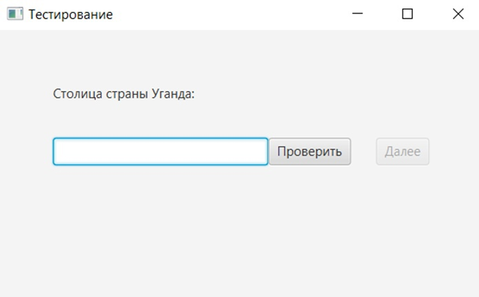
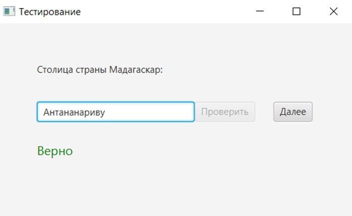
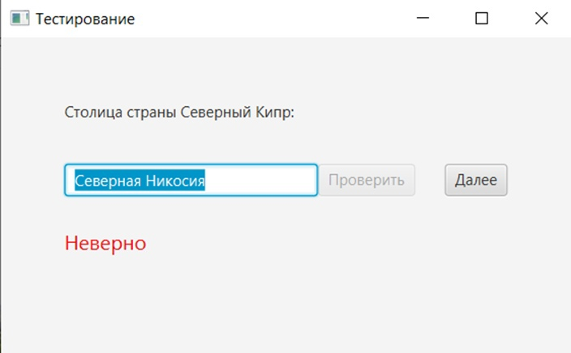
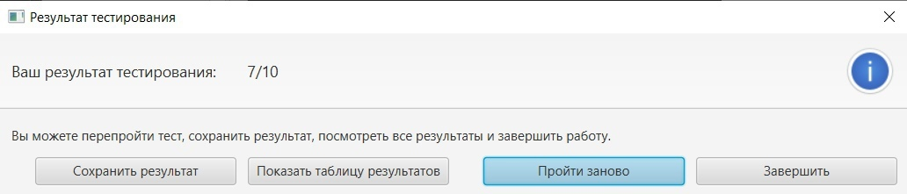
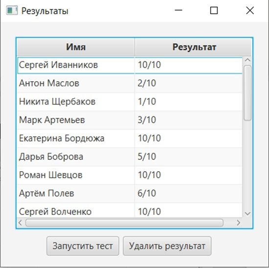

# Обучающая программа "Страны мира"
В рамках данного курсового проекта была разработана обучающая программа "Страны мира", которая поможет обучающим и другим пользователям программы проверить приобретенные знания путем прохождения тестирования, а преподавателям контролировать знания обучающих при помощи просмотра таблицы результатов.

## Интерфейс программы
## Главное окно

## Окно с верным ответом на вопрос

## Окно с неверным ответом на вопрос

## Окно с результатом пройденного теста

## Таблица результатов

